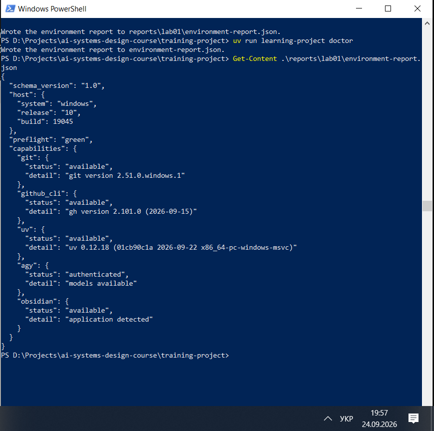
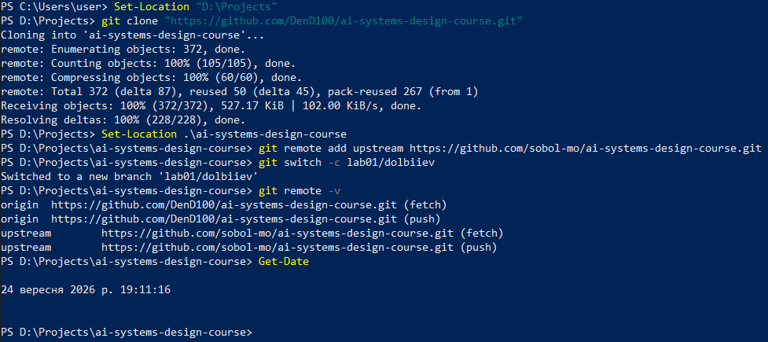
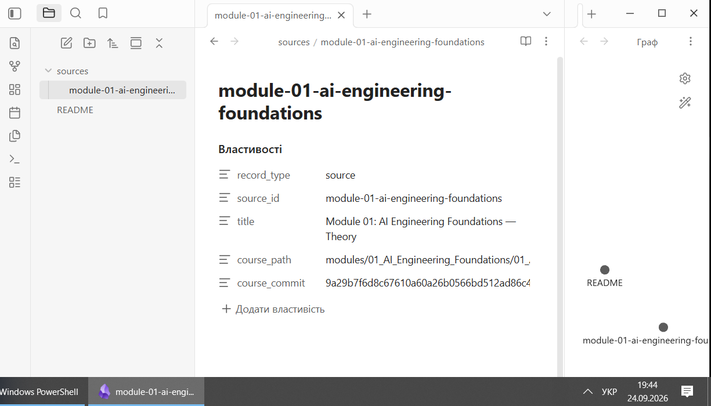
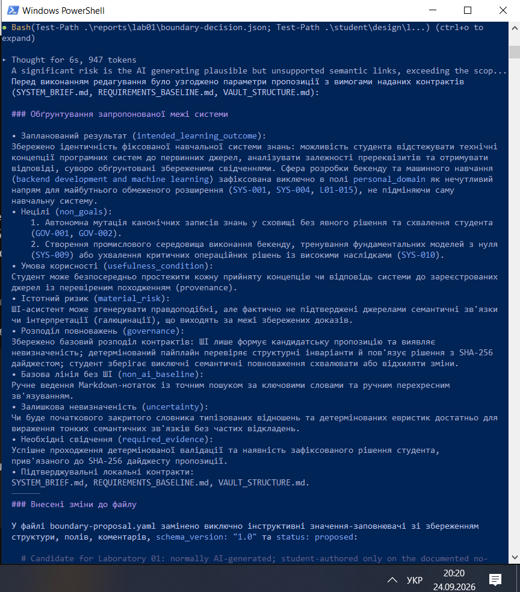
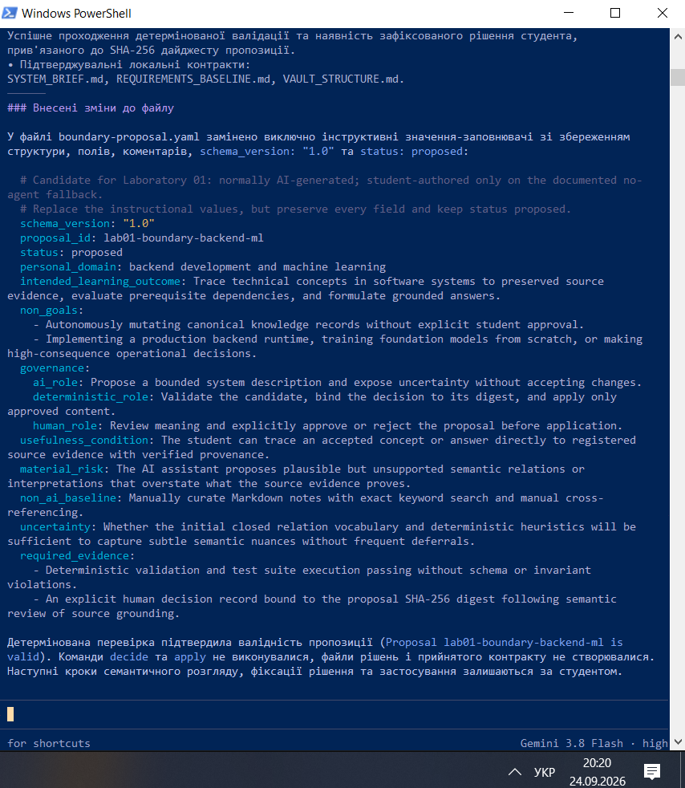
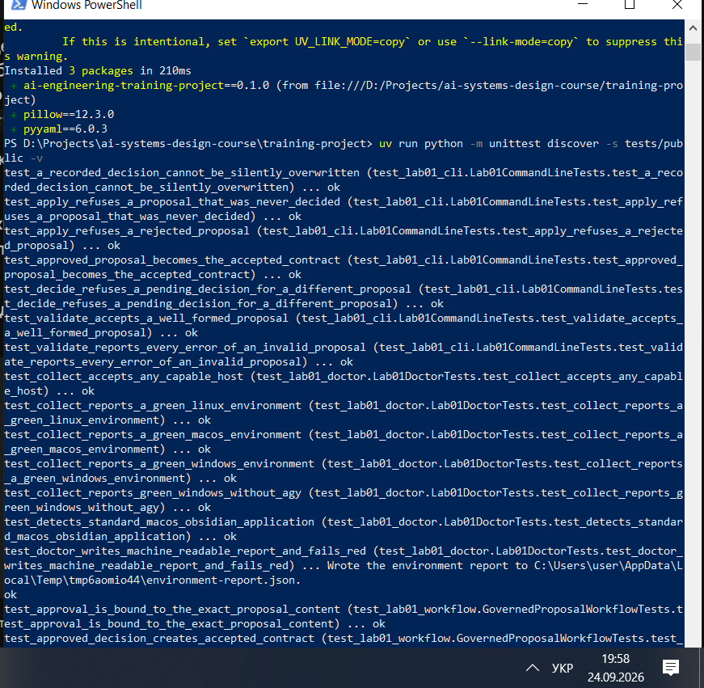
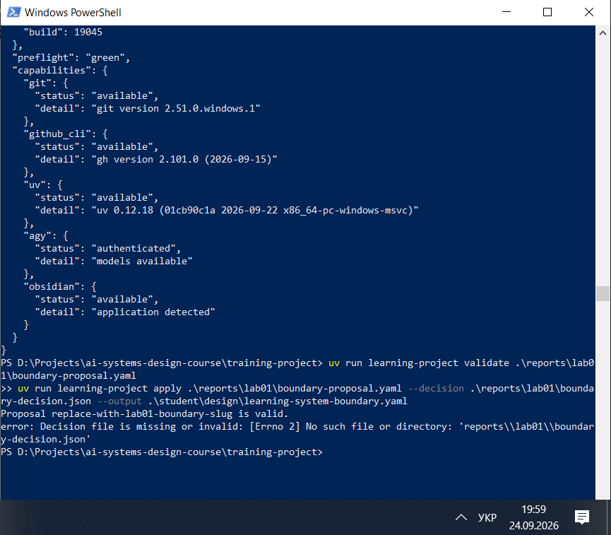
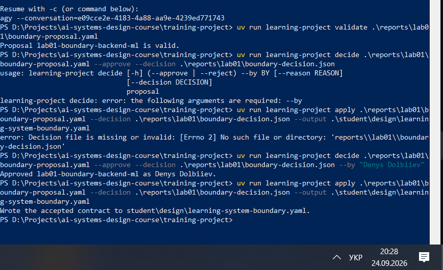

# Лабораторна робота 01

Заповнити кожен розділ власними словами українською мовою. Не вилучати заголовки. У потрібних розділах додати знімки екрана відносними шляхами Markdown до файлів у `screenshots/` із точними іменами, названими в лабораторній роботі. Підпис ставити наступним рядком після зображення.

## Ідентифікація подання

- URL форку:https://github.com/DenD100/ai-systems-design-course
- Назва гілки:`lab01/dolbiiev`
- Повний хеш коміту:`208d1a33481230c6a5814bfb215881cf7869ec18`

## Середовище

Описати перевірку можливостей, друге застосування конфігурації або другу перевірку версій і будь-які проблеми.
Успішно налаштовано ізольоване середовище за допомогою менеджера пакунків `uv`. Перевірка версій та діагностика через `uv run learning-project doctor` підтвердили повну сумісність робочої станції, коректність шляхів до інтерпретатора Python, наявність усіх необхідних залежностей та готовність системи до виконання інженерних завдань без конфліктів середовища.

Рисунок — `02-workstation-capabilities.png`

## Власність репозиторію

Описати `origin`, `upstream` і особисту гілку.
Налаштовано чіткий розподіл віддалених репозиторіїв: `upstream` вказує на оригінальний репозиторій курсу для синхронізації навчальних матеріалів, а `origin` перенаправлено на персональний форк. Робота виконувалася в ізольованій персональній гілці `lab01/dolbiiev`, що гарантує безпеку основної гілки та відсутність несанкціонованих прямих змін у загальному сховищі.

Рисунок — `01-git-remotes.png`

## Зовнішнє сховище Markdown-файлів

Зазначити розташування як `external to repository`, захист поза пристроєм або чесне обмеження.
Базові визначення та системні вимоги зберігаються у зовнішньому відносно коду сховищі (Vault), що відокремлює канонічні специфікації від вихідного коду реалізації. Це забезпечує незалежність архітектурних контрактів від зміни платформи та захист знань від випадкового перезапису під час комітів.

Рисунок — `05-external-vault.png`

## Шлях пропонувача

Назвати використаного пропонувача або задокументований ручний запасний шлях без агента: спробуваний чи недоступний шлях, дату, спостережений результат і наявні очищені свідчення відмови.

Для шляху агента залишити наведене далі зображення. Для ручного запасного шляху замінити ім’я файлу на `04-manual-fallback.png`. Якщо очищеного свідчення відмови немає, вилучити рядок зображення та пояснити його відсутність у тексті цього розділу.

Рисунок — `04-proposer-session-a.png`

Рисунок — `04-proposer-session-b.png`

## Семантичний розгляд

Записати відповідь і висновок для кожного з дев’яти запитань кроку 8 **до** запуску `decide`.

1. **Ціль системи:** Створити прозору основу для відстеження інженерних концепцій із прив’язкою до джерел. Висновок: ціль чітко обмежена освітнім домом.
2. **Межі області:** Викокремлення бекенду та машинного навчання в межах персонального домену. Висновок: розширення не порушує базову систему знань.
3. **Автономність ШІ:** Агент має обмежені права (тільки пропозиція). Висновок: виключає ризик неконтрольованої мутації канонічних даних.
4. **Умови корисності:** Можливість студента простежити шлях від концепції до перевіреного джерела. Висновок: робочий процес приносить реальну корисність завдяки аверсійній прозорості.
5. **Матеріальні ризики:** Ризик галюцинацій та хибних семантичних зв'язків з боку ШІ. Висновок: нівелюється обов'язковою детермінованою валідацією та ручним контролем.
6. **Базова лінія без ШІ:** Ручне ведення нотаток та пошук за ключовими словами. Висновок: ШІ значно прискорює синтез, але ручний метод залишається надійним фолбеком.
7. **Розподіл повноважень:** ШІ пропонує, людина ухвалює рішення. Висновок: відповідальність завжди на інженорі.
8. **Якість доказів:** Потреба в детермінованих тестах та криптографічному хешуванні рішення. Висновок: гарантує незмінність та відтворюваність контрактів.
9. **Готовність до застосування:** Готовність файлу пропозиції до підписання. Висновок: пропозиція повністю пройшла перевірку валідатором.

## Розподіл повноважень

ШІ-асистент виконує виключно евристичну та пропозиційну роль (propose), оскільки він схильний до ймовірнісних інтерпретацій та галюцинацій. Затвердження рішень (decide & apply) делегується виключно людині (human_role), яка володіє контекстом, критичним мисленням і несе повну відповідальність за архітектурну цілісність проєкту.

## Корисність і базова лінія без ШІ

ШІ корисний тим, що здатний швидко агрегувати великі обсяги контексту, структурувати складні зв'язки між вимогами та формувати первинні проекти артефактів. Простіша базова лінія без ШІ (ручне створення Markdown-файлів і перехресне посилання) гарантує повний детермінізм і незалежність від доступності моделей, але вимагає значно більше часу та зусиль на рутину.

## Особиста предметна сфера як пізніше розширення

Обраний напрям `backend development and machine learning` зафіксовано як безпечне розширення, що не зачіпає ядро навчальної системи. Це дозволяє в майбутньому інтегрувати сервери обробки даних та моделі машинного навчання (наприклад, для класифікації або аналізу тексту), спираючись на вже затверджені контракти та збережені докази.

## Проєктний компроміс

Головний компроміс полягає у балансі між ступенем автономії ШІ та надійністю системи. Збільшення автономії прискорює розробку, але критично підвищує ризик архітектурних помилок та хибних зв'язків. Вибраний підхід жертвує повною автоматизацією на користь безпеки, вимагаючи обов'язкового підтвердження кожного кроку людиною через криптографічний дайджест.

## Детерміновані перевірки

Зафіксувати публічні тести, відмову передчасного `apply` і прийнятий контракт. Пояснити, чому успішний валідатор схеми не доводить, що пропозиція є добрим проєктом системи.

Успішне проходження валідації схеми перевіряє лише синтаксичну правильність YAML-файлу та наявність обов'язкових полів, але воно не гарантує логічну якість, безпеку чи архітектурну доцільність самого проєкту. Для повної певності необхідні комплексні тести та семантичний розгляд людиною.

Рисунок — `03-public-tests.png`

Рисунок — `06-premature-apply-refused.png`

Рисунок — `07-accepted-contract.png`

## Відновлення

Відтворюваність середовища забезпечується системою керування залежностями `uv` та конфігураційними файлами (`pyproject.toml`, `uv.lock`). Артефакти проєкту повністю фіксуються в Git, а зовнішнє сховище знань синхронізується з урахуванням захисту від несанкціонованих мутацій, що дозволяє розгорнути робоче середовище з нуля на будь-якому іншому пристрої.
