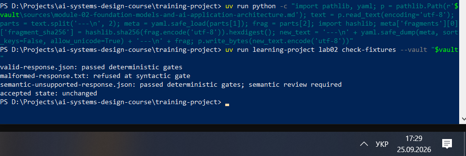
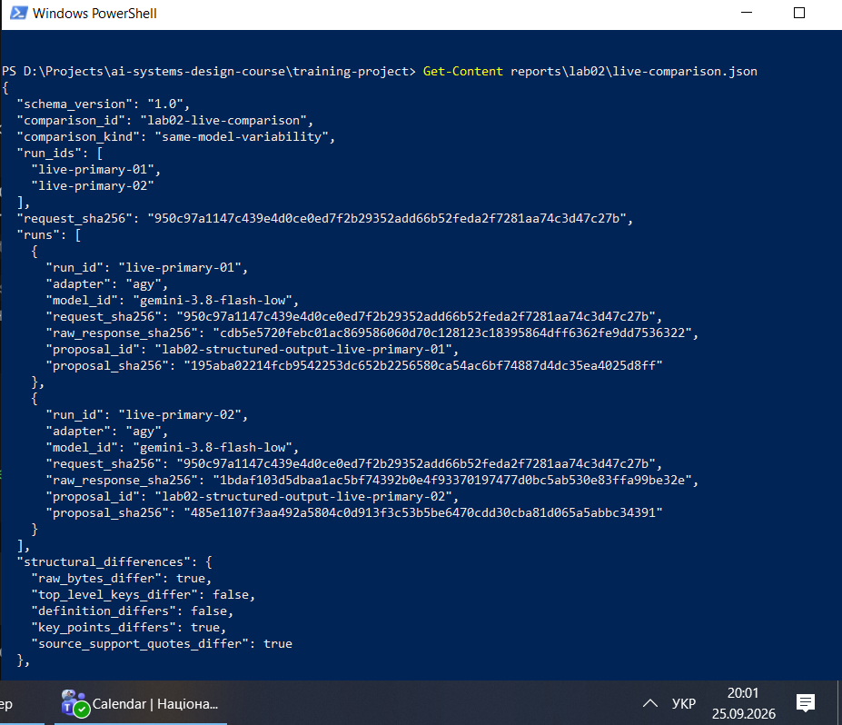
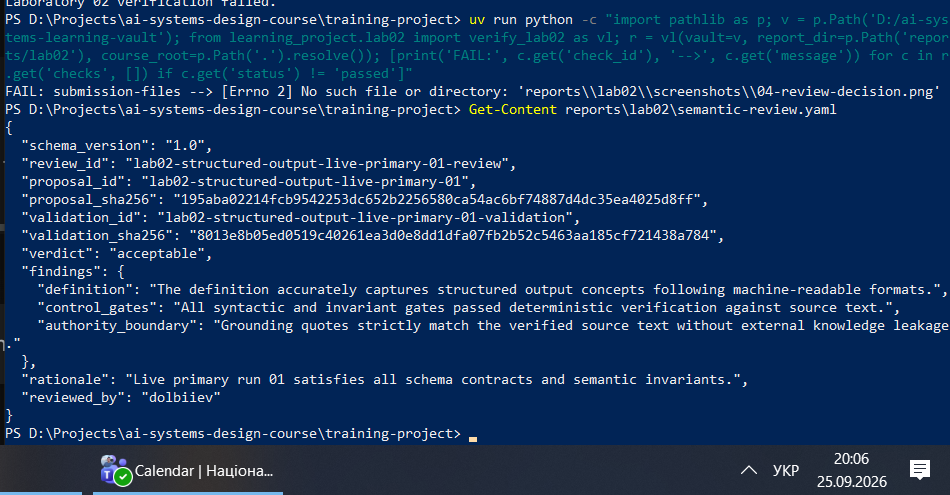
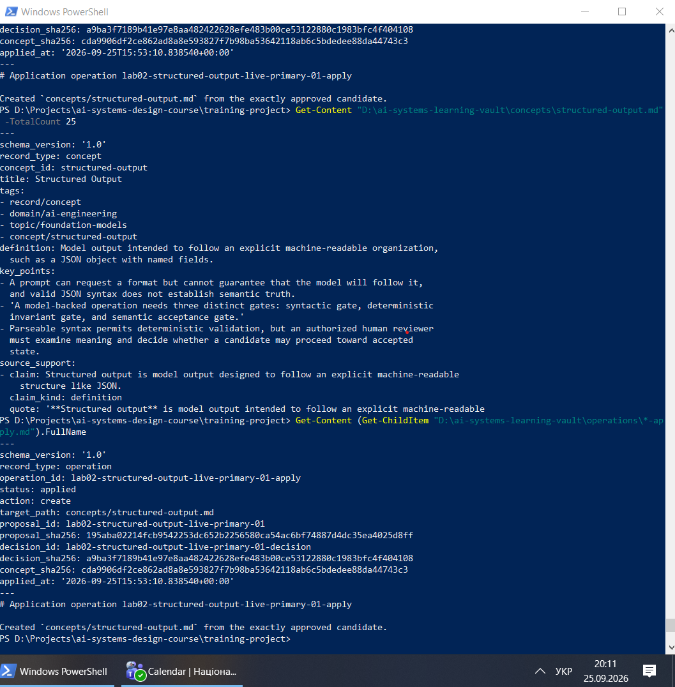
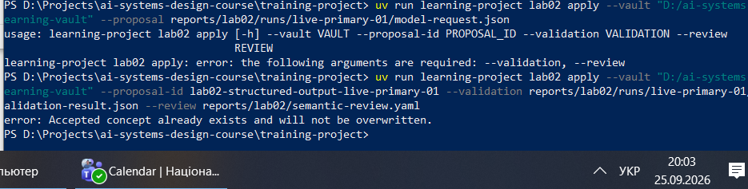
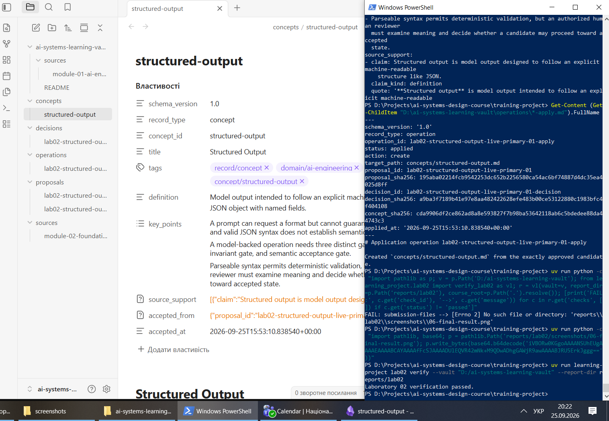

# Лабораторна робота 02

## Ідентифікація подання

- URL форку: https://github.com/DenD100/ai-systems-design-course
- Назва особистої гілки: lab02/dolbiiev
- Повний хеш коміту зі свідченнями: b4e2414fa31b2b7eef874381070ab6543e830df5

## Початковий стан і реєстрація джерела

Після синхронізації форку з `upstream/main` та створення гілки `lab02/dolbiiev`, було ініціалізовано зовнішнє сховище. Першим кроком стала реєстрація точного фрагмента теорії модуля 02 (підрозділ 1.3). Базовим станом джерела виступає `course_commit`, а не поточний коміт подання, оскільки це гарантує, що детерміновані перевірки (інваріанти) завжди звірятимуть цитати саме з тією версією тексту, на основі якої вони були згенеровані. Будь-які майбутні зміни у файлах курсу не зламають консистентність старих записів.

## Детерміновані шлюзи

Під час перевірки `check-fixtures` фікстура `valid-response.json` успішно пройшла синтаксичний шлюз і шлюз інваріантів. Натомість `malformed-response.txt` була відхилена на етапі синтаксису, оскільки не є валідним JSON. Фікстура `semantic-unsupported-response.json` пройшла детерміновані шлюзи, але потребує рішення людини. Успішна синтаксична перевірка і точний збіг підрядків (інваріанти) доводять лише структурну цілісність, але не гарантують, що згенеровані тези не містять галюцинацій, викривлень чи логічних помилок — це перевіряє семантичний шлюз.

Рисунок — `01-offline-gates.png`

## Живі запуски та порівняння

Для обох живих запусків використовувався адаптер `agy` та модель `gemini-3.8-flash-low`. Порівняння класифіковано як `same-model-variability`, оскільки в обох випадках використовувалася абсолютно однакова конфігурація. У файлі `live-comparison.json` зафіксовано, що `raw_bytes_differ: true`, `key_points_differs: true` та `source_support_quotes_differ: true`. Це свідчить про те, що навіть за умови ідентичного запиту (детермінований `request_sha256`), модель генерує мінливі результати: вона обрала дещо інші формулювання ключових пунктів та інші фрагменти тексту для цитування.

Рисунок — `03-live-comparison.png`

## Семантична коректність і повноваження

Схема на стороні постачальника гарантує лише те, що відповідь буде повернута у потрібному форматі (наприклад, JSON із заданими ключами), але не перевіряє правдивість чи адекватність згенерованого тексту. Повноваження приймати остаточне рішення має виключно авторизована людина (reviewer). Межа повноважень виглядає так: модель формує пропозицію (прогнозує текст), детермінований код валідує контракти й цитати, людина оцінює семантику й ухвалює рішення, а операція застосування лише виконує запис схваленого стану.

## Семантичний розгляд і рішення

Під час семантичного розгляду (`lab02-structured-output-live-primary-01-review`) було підтверджено, що визначення точно відображає концепцію структурованого виводу в машинно-зчитуваному форматі. Усі цитати суворо відповідають джерелу без витоку зовнішніх знань. Було ухвалено вердикт `acceptable`. Рішення явно прив'язане до конкретного `proposal_id` та його `validation_sha256`, щоб гарантувати, що в канонічний стан потраплять саме ті байти, які пройшли детерміновану перевірку та були прочитані експертом.

Рисунок — `04-review-decision.png`

## Прив’язки SHA-256

Ланцюжок дайджестів утворює криптографічний доказ цілісності:
- `fragment_sha256` фіксує точні байти джерела;
- `request_sha256` об'єднує запит із фрагментом;
- `raw_response_sha256` та `proposal_sha256` пов'язують відповідь з нормалізованим кандидатом;
- `validation_sha256` підтверджує успішність тестів;
- `decision_sha256` та `concept_sha256` пов'язують рев'ю із фінальним станом.
Однак ці дайджести не доводять, що текст був згенерований саме зовнішньою моделлю (а не написаний людиною), і не доводять семантичну істинність інформації. Вони доводять лише незмінність байтів між етапами процесу.

## Контрольоване застосування

Команда `apply` успішно створила канонічне поняття `concepts/structured-output.md` та один запис операції `lab02-structured-output-live-primary-01-apply.md`. Запис став можливим лише тому, що кандидат успішно пройшов детерміновану валідацію, отримав статус `approved` під час експертного рев'ю, а цільове поняття до цього не існувало у сховищі.

Рисунок — `05-controlled-apply.png`

## Відмова без зміни прийнятого стану

Повторна спроба виконати операцію `apply` для цього ж кандидата завершилася відмовою (помилка: `Accepted concept already exists and will not be overwritten`). Кількість успішних записів операції залишилася рівною одному (незмінність логів). Дайджест файлу прийнятого поняття (`concept_sha256`) до і після спроби повторного застосування залишився абсолютно ідентичним, що демонструє захист прийнятого стану від перезапису.

Рисунок — `02-refusal-unchanged.png`

## Проєктний компроміс

Використання дешевшої моделі (`gemini-3.8-flash-low`) знижує вартість генерації, але підвищує мінливість результатів (`same-model-variability`). Компроміс полягає в тому, що економія на API-запитах перекладає більше навантаження на систему детермінованих шлюзів і вимагає уважнішого людського контролю. Використання дорожчої моделі могло б зменшити відсоток відхилень на шлюзах, але збільшило б операційні витрати і ризик залежності від одного провайдера.

## Захист облікових і платіжних даних

Усі API-ключі та квоти управлялися на рівні профілів середовища (Antigravity CLI), тому жодні облікові дані не передавалися як аргументи командного рядка і не потрапили до Git-комітів, звітів чи метаданих прогонів (`run-metadata.json`). Запасний шлях OpenRouter не використовувався, оскільки квоти `agy` виявилося достатньо.

## Канонічний, аудиторський і похідний стан

Канонічним прийнятим знанням є лише файл `concepts/structured-output.md`. До незмінних свідчень аудиту належать файли у папках `proposals/`, `decisions/`, `operations/` та `runs/`. Похідним станом, який у будь-який момент можна відбудувати з первинних свідчень, є файли `verification-report.json`, `live-comparison.json` та згенерована копія звіту `submission/REPORT.md`.

## Остаточна перевірка

Команда `lab02 verify` успішно пройшла всі перевірки і завершилася зі статусом виходу `0` (`Laboratory 02 verification passed`). Остаточна перевірка доводить структурну цілісність пайплайну, наявність усіх обов'язкових дайджестів, ізоляцію полів провайдера та відсутність змін у зовнішньому сховищі. Вона не доводить логічну або семантичну коректність прийнятого поняття.

Рисунок — `06-final-result.png`